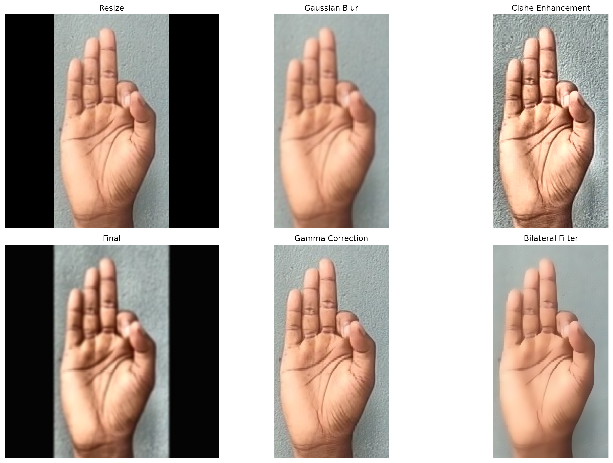
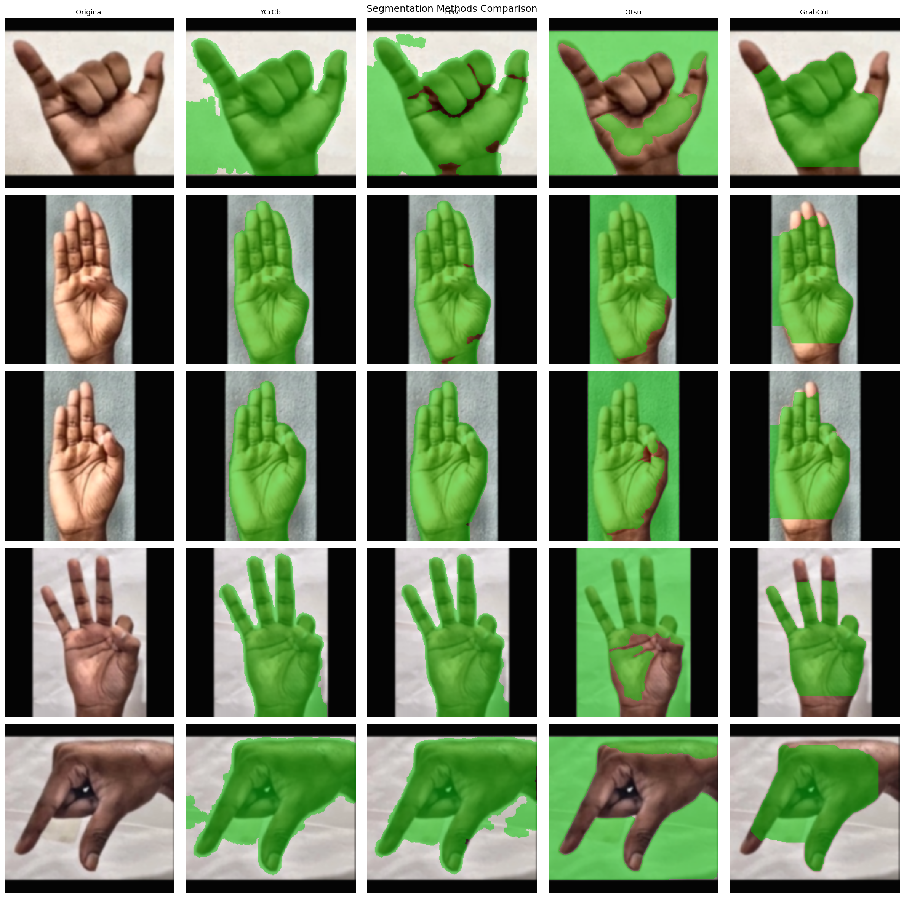
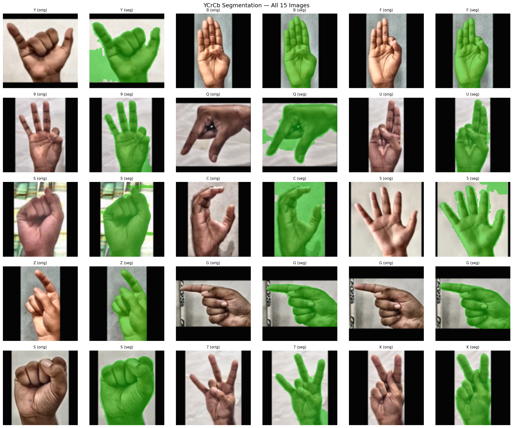
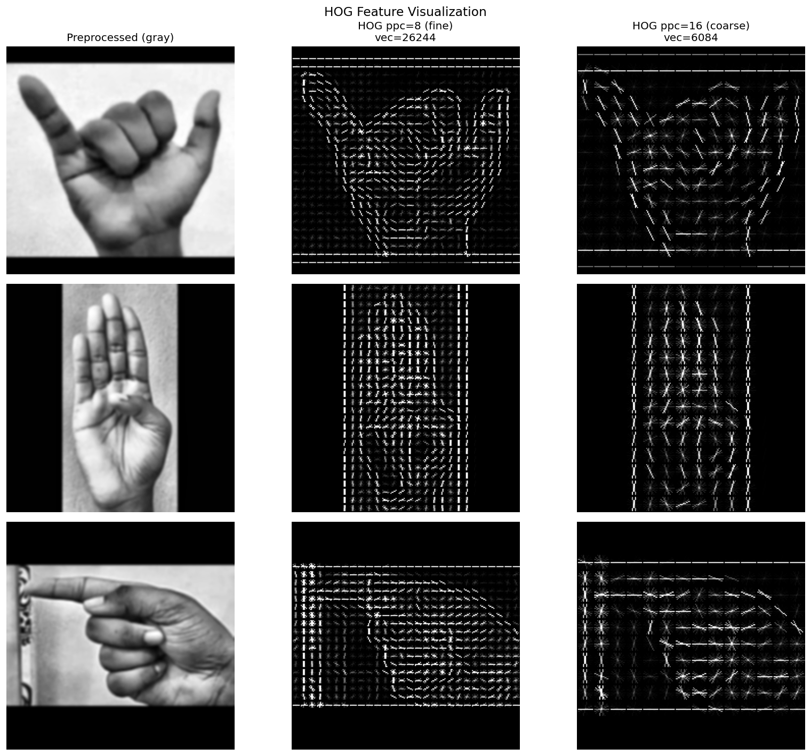
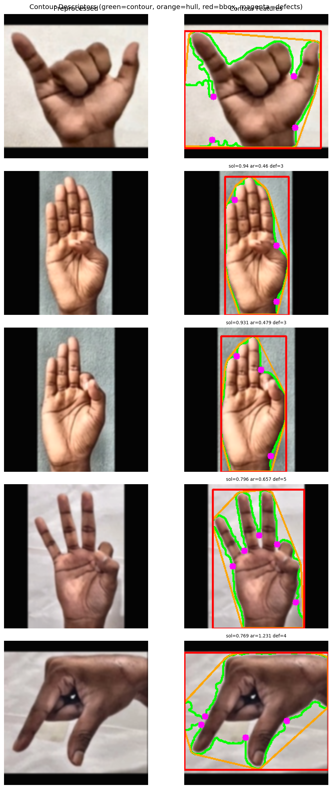
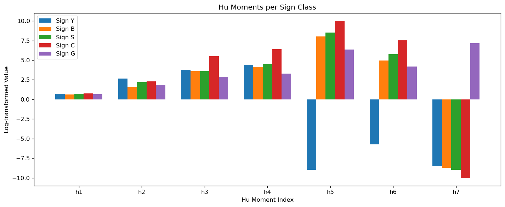

# Sign-Language-Recognition Project

**Team:** Leonardo Molina, Alphonsus Koong Bok Hui  
**Course:** CSE 40535 Computer Vision, Spring 2026  

# Repository Structure
```bash
sign-language-recognition/
├── notebooks/               # Python notebooks for testing ideas
├── sample_data/             # Sample Images
├── scripts/                 # Download Data from source 
├── src                      # Download Data from source 
│   └── pipeline.py          # Full pipeline to transform imgs
└── tests/                   # Testing src code 
```
# Methods Applied and Justification
## Preprocessing 
### Resize (Leo)

The resize operation resizes the image to the specified size while maintaining the ratio of the image. This is the first preprocessing step applied to all images as they all varied in size. We mainly applied this transformation to have consistent image dimensions when feeding into our neural network. Laslty, many pretrained models use images that are (224, 244) and thus this is the default size that all images are resized into. This can be easily changed by the passing in `target_size` in the constructor of the `Preprocessor` class. 

### Gamma Correction (Leo)

Gamma correction is a non-linear adjustment of image brightness used to map pixel values on light intensity. In application it prevents images from appearing too dark or washed out. We did this because the dataset was captured in indoor and outdoor with varying lighting. Thus, we applied gamma correction to produce images that are more similar to each other and thus the only difference being the hand gestures. Then when these images are feed into our neural network the features learned are on the actual hand rather than on the differences in brigthness/contrast. Note, I used this [website](https://pyimagesearch.com/2015/10/05/opencv-gamma-correction/) to get the transformation to work. 

### Bilateral Filtering (Leo)

Bilaterla Filtering removes noise from an image while keeping edges sharp. In the dataset we have 10 different participants who took the images in various different lighting and mostly uniform background. This operation was mainly performed to remove any noise that images had but also maintaining the edges assoicated with the hand. We believe this will be important when we pass these images into the Neural Network in order to learn features from the actual hand gesture rather than the noise. Note I just this [website](https://docs.opencv.org/4.x/d4/d13/tutorial_py_filtering.html) to get my transformation to work. 

### Clahe enhancement (Al)

CLAHE (Contrast Limited Adaptive Histogram Equalization) is applied to the L channel of the LAB color space using a clip limit of 2.0 and an 8×8 tile grid. The idea is that regular histogram equalization works globally — it looks at the whole image and stretches contrast across the board — but that tends to wash things out or over-amplify noise in already well-lit areas. CLAHE fixes this by dividing the image into small tiles and equalizing each one independently, then blending the results so there are no hard seams. Working in LAB means we only touch the luminance (L) and leave the color channels (A, B) alone, so skin tone doesn't get distorted in the process. This matters a lot for our dataset since it's 10 different people, shot in different environments — some images are darker, some have harsher lighting — and we need the hand to look consistent before we try to segment it.

### Gaussian Blur (Leo)

This operation is similar to bilateral filtering as it removes noise from the image by convolving the image with a low-pass filter kernel. The only difference between Gaussian Blur and Bilateral filtering is that Gaussian Blur does not maintain the edges of the images. Nonetheless we still believed this fundamental operation must be part of our pipeline to reduce noise in images. Again the same [website](https://docs.opencv.org/4.x/d4/d13/tutorial_py_filtering.html) was used. 

## Segmentation 

### HSV mask (Leo)

HSV mask sets a range from the lower and the upper bound of pixels it can capture. This idea was taken from practical 1 with the invisibility cloak applied to our hand segementation. We implemented this to create one way to segment the hand from the background. Our idea was to perform and bitwise and operation with a mask to extract the hand fully from the background. This extracted hand could be used to be feed into our neural netwok. 

### Morphological Operators (`refine_mask`) (Leo)

Morphological operators were used to refine the HSV mask that was created. This is because by itself the map had holes inside it that needed to be cleaned up. The Morphological operators used were `OPEN` and `CLOSE` with an ellipse kernel. [Website](https://docs.opencv.org/4.x/db/df6/tutorial_erosion_dilatation.html) used and class code. 

### YCrCb Mask (Al)

For segmentation, the goal is to isolate the hand from the background. We do this by thresholding on skin color in the YCrCb color space, using the range Cr: [133, 173], Cb: [77, 127] from Kovac et al. (2003). YCrCb is a better choice than RGB or even HSV for this because it separates luminance (Y) from the color information (Cr, Cb). Skin color in Cr-Cb space is surprisingly stable across different lighting conditions — the hue of skin doesn't shift as dramatically when the brightness changes. After thresholding we get a noisy raw binary mask, so we clean it up with morphological operations: erode twice to break thin bridges connecting the hand to other skin-colored regions in the background, then dilate twice to restore the hand's actual boundary. We use an elliptical kernel because hand blobs have curved edges, not rectangular ones.

### Finding Contours (Al)

After the morphological cleanup, there can still be multiple disconnected blobs in the mask — parts of the wrist, arm, or face that made it through the threshold. To get a clean single-hand mask, we find all external contours in the binary image and keep only the largest one by area. That region gets filled and returned as the final clean mask, along with the contour itself for use in feature extraction.

## Feature Extraction 

### Canny Edges (Leo)

Canny edges aims to satisfy three main criteria: 1. low error rate 2. Good localization 3. Minimal Response. More details are found on this [website](https://docs.opencv.org/4.x/da/d5c/tutorial_canny_detector.html). The main purpose of this feature extraction was to get the edges from the actual hand. Getting the edges from the hand as well as the edges from the fingers allows use to distinguish different hand gestures. Since we are doing neural networks we would like to compare our logits to see if the NN learned anything on the edges and compare the different features. In the notebook exploration I ran the code from the website to find the best `low_threshold` for the images in the dataset. 

### Hog Features (Al)

HOG (Histogram of Oriented Gradients) is our main feature descriptor. The idea is to divide the image into small cells (8×8 pixels), compute the gradient direction and magnitude at each pixel, and bin those directions into a histogram for each cell. We use 9 orientation bins and group cells into 2×2 blocks for local contrast normalization. At 224×224 this gives us a 26,244-element feature vector. The reason HOG works well for sign language is that hand signs are fundamentally about shape — the angles of your fingers, the curve of your palm, whether your hand is open or closed. HOG directly captures the distribution of edge directions in local regions, which maps pretty naturally onto those geometric structures. It's also more robust to lighting changes than raw pixel values since it's based on relative gradient magnitudes.

### Contour Features (Al)

From the segmented hand contour we extract six scalar shape descriptors: area, perimeter, solidity (area / convex hull area), aspect ratio (width / height of the bounding rect), extent (area / bounding rect area), and convexity defect count (number of significant finger gaps, where depth > 5px). These complement HOG by capturing global shape properties that local gradient features don't directly encode. Solidity is particularly useful — a closed fist like "B" or "S" has high solidity (~0.9) while an open hand like "Y" or "G" has a lower value because the fingers create concavities in the convex hull. Defect count is a rough proxy for how many fingers are extended, which is obviously important for distinguishing signs.

### Hu moments (Al)

We also compute the seven Hu Moments from the contour, log-transformed for numerical stability. Hu Moments are derived from image moments and are invariant to translation, scale, and rotation — meaning the same sign held at a slightly different angle or distance should produce similar moment values. This makes the classifier more robust to natural variation in how someone positions their hand. We use the contour directly rather than the full image so we're computing moments on the hand shape only, not the background.

# Results 
## Preprocessing (Leo)
Below are all the preprocessing operations done separately from each other: Resizing, Gaussian Blur, Clahe Enhancement, Gamma correction and Bilateral Filtering 



On the left bottom corner we have the final pipeline which consists of resize -> gaussian blur -> Clahe Ehancement. But, since our code is built in a class structure it is really easy to interchange the order of preprocessing. 

## Segmentation (Al)

We compared four segmentation approaches on a set of sample images: YCrCb thresholding, HSV thresholding, Otsu thresholding on grayscale, and GrabCut. The comparison is shown below.



YCrCb came out the most consistent across the dataset. HSV thresholding was hit or miss depending on the background color — it struggled whenever the background had warm tones similar to skin. Otsu failed on images where the hand and background had similar overall brightness, which happened fairly often. GrabCut was the slowest and tended to miss finger tips at the edges of the bounding rect.

The YCrCb results across all 15 sample images:



## Feature Extraction (Al)

**HOG:** The visualization below shows HOG gradient maps for three different signs. You can see distinct patterns corresponding to finger orientations — the edge directions in the HOG image are clearly different between an open hand (Y) and a closed fist (B), which is exactly what we want the classifier to pick up on.



**Contour features:** The plot below shows the contour, convex hull, bounding rect, and convexity defect points overlaid on the segmented hand. The scalar values (solidity, aspect ratio, defect count) printed in the titles give a sense of how these features differ between signs.



**Hu Moments:** The bar chart compares log-transformed Hu Moment values across several sign classes. The pattern of values differs meaningfully between signs, especially in the first two or three moments which capture the most variance in overall shape.


# How to run the code (Leo)
* More examples on how to run the code in `test/pipeline_test.ipynb`.

```python
import pipeline
import cv2

img = cv2.imread("file_path")
preprocessor = Preprocessor()
segmentation = Segmentation()
feature_extractor = FeatureExtraction()

# All classes return dictionary with images
preprocessor_results = preprocessor.preprocess(img)
segmentation_results = segmentation.segment(img)
feature_results = feature_extractor.extract_all(img, segmentation_results['contour'], segmentation_results['ycrcb_mask'])
```

# Individual Contributions 
- Note: We completed preprocessing, segmentation, and feature extraction independently to get as many ideas as we could. Leos branch is called `feat-preprocessing-leo` Alphonsus branch is called `feature/preprocessing-extraction`. Alphonsus branch was merged into Leos branch and all merge conflicts were resolved then merged into main. 
- Leo: Resize, Gamma correction, Bilateral Filtering, Gaussian Blur, HSV mask, Morphological Operators, Canny Edges, How to run the code, preprocessing, and merging the files togehter. 
- Alphonsus: CLAHE enhancement, YCrCb skin segmentation, contour extraction, HOG feature extraction, contour shape descriptors, Hu Moments, segmentation and feature extraction results in the README